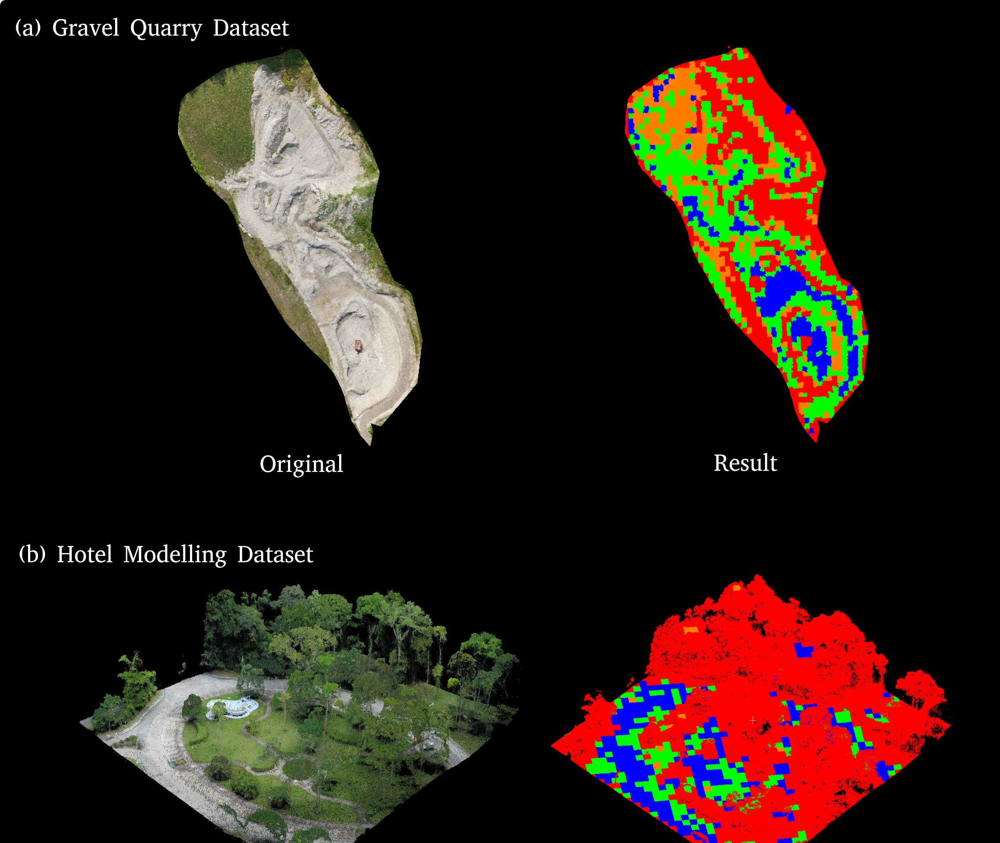
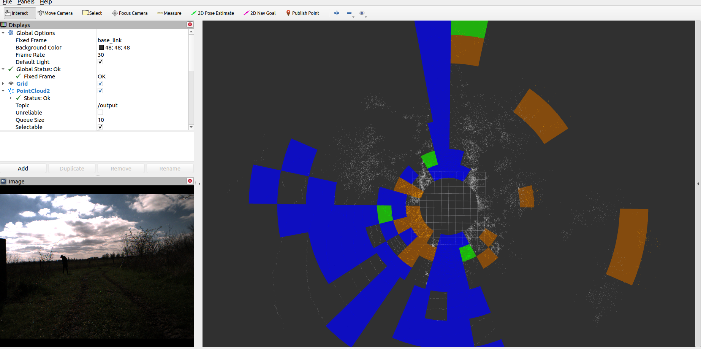

# BumpyPatch

evaluate terrain <b>Bumpi</b>ness by heightmap <b>Patch</b>

## About BumpyPatch

Unlinke indoors where the driving environment is predictable, mobile robots might encounter various road conditions when it is driving outdoors. Mobile robots, which often carry sensitive equipment on their chassis or carry beverages (in the case of delivery robots) need to decide where is the stable road even within areas classsified as "traversable area". 
Therefore, by analyzing the correlation between IMU , which can digitalize the moveness of the chassis and heightmap of the road, the goal was to evaluate the driving stability by predicting "less bumpy roads" in advance. 

### Keywords 

Outdoor Off-road Mobile Robot, LiDAR, Point Cloud Processing, Traversable Ground Segmentation

### Test Env

- Ubuntu 20.04 LTS
- ROS Noetic

## Result

### Static Scene



### Dynamic Scene


## How to use

### 1. Static Scene :

run.py executes all the necessary code. Just change the content of *original_pcd* to your desired file.

```
python3 run.py
```

When you run this file, a folder containing cropped images, a CSV file, and a recolorized pcd file will be generated. This make take a few minutes...

- Dataset
    - PCD file that has been used in the research was downloaded from [AgEagle Dataset](https://ageagle.com/data-set/gravel-quarry/)


### 2. Dynamic Scene :

- ROS settting : jsk-visualization is required to visualize results as polygons in Rviz
```
sudo apt-get install ros-noetic-jsk-recognition
sudo apt-get install ros-noetic-jsk-common-msgs
sudo apt-get install ros-noetic-jsk-rviz-plugins
```
- Compile the package in your catkin workspace :
```
cd ~/catkin_ws/src
git clone -b final https://github.com/zzziito/BumpyPatch.git
cd .. && catkin_make
```
- Prepare the dataset
    - RELLIS-3D rosbag data


- How to run Bumpypatch

first, you need to change the name of directory that contains the pretrained weight for Learning-based method.

```python
model.load_state_dict(torch.load('/home/rtlink/jiwon/bumpypatch_ws/src/bumpypatch/model/mobilenetv2_10.pth')) # you have to change this
```
than, compile all the file using catkin. 

```
source devel/setup.bash
roslaunch bumpypatch bumpypatch.launch
```
another terminal has to play rosbag file : 

``` 
rosbag play 20200213_trail_2.bag 
```

Then automatically the rviz will be started.



- Topics of BumpyPatch and how to visualize them
    - output (sensor_msgs/PointCloud2) : 
    - polygons (jsk_recognition_msgs/PolygonArray) :
    - normal_vector_marker (visualization_msgs::Marker) :


## Repository content :

1. source code 
  * in case of <b>Static Scene</b> : 
    * Heightmap Generation (pc_to_heightmap_patch.py)
    * Applicate the classification model to each patch (model_application.py)
    * Evaluate final class for each patch 
    * Colorize point cloud based on the final classes (pc_colorize.py)
  * in case of <b>Dynamic Scene</b> : 
    * subscribe ros topics of RELLIS-3D rosbag datasets
    * Evaluate point cloud data by patch
    * Assume the area's normal vector using PCA
    * Learning-based method : inference the texture analysis model
    * Filter-based method : Analyze the texture using Gabor filter 
2. Media (for Static scene)
  * hotel_modelling.pcd 
  * gravel_quarry.pcd


## Software Requirements

In order to use the provided scripts, these are the list of requirements:

```
 * Ubuntu 20.04
 * Python 3.10
 * Pytorch
 * Matplotlib
 * Open3d 0.13.0
 * OpenCV 4.5.5
```

### Contact

If you have any questions, please let me know :
- Jiwon Park {[overflow21@khu.ac.kr]()}
